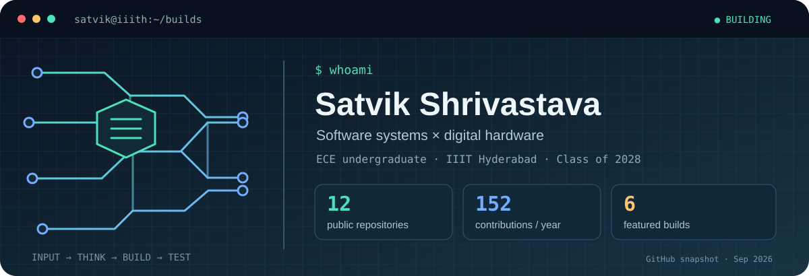

  

### Hello, I'm Satvik 👋

I'm an Electronics and Communication Engineering undergraduate at **IIIT Hyderabad**. Current working as an undergrad researcher at Robotics Research Center, IIITH. My interest lies in algorithms, system design and lil bit of electronics.

My goal is to make technically deep work approachable. Each repository below has an implementation and a write-up you can inspect, run, or build on.

### Start here

| If you're interested in… | Explore | What you'll find |
| --- | --- | --- |
| Developer tools | [CodeContour](https://github.com/Blotify/CodeContour) | A local-first Python architecture explorer with dependency graphs, cycle detection, and change-impact tracing. |
| Distributed systems | [Network File System](https://github.com/Blotify/Network-File-System) | A C file system with a name server, replicated storage, access control, and checkpoints. |
| Operating systems | [xv6 Scheduler](https://github.com/Blotify/XV6-Scheduler) | FCFS, CFS, and round-robin scheduling for xv6-riscv, plus an I/O accounting syscall and benchmarks. |
| Processor design | [RISC-V Processor](https://github.com/Blotify/RISC-V-Processor) | Single-cycle and five-stage pipelined RV64I designs in Verilog, with hazard handling and testbenches. |
| VLSI and digital logic | [5-Bit CLA Adder](https://github.com/Blotify/5-Bit-CLA-Adder) | A 180 nm CMOS carry-lookahead adder taken from circuit design through layout, simulation, and FPGA validation. |
| Sensors and analog design | [PPG Sensor](https://github.com/Blotify/PPG-sensor) | An IR heart-rate sensor with analog signal conditioning and an OLED readout. |

### Working set

`Python` · `C` · `Verilog` · `RISC-V` · `Docker` · `OpenCV` · `NGSPICE` · `MATLAB`

I'm especially interested in **systems software, computer architecture, robotics, and hardware design**. The pinned repositories below are a good place to see the code and reports.

The banner is an original illustration. Its GitHub counts are a snapshot from September 2026; the live contribution graph below is the current source of truth.
